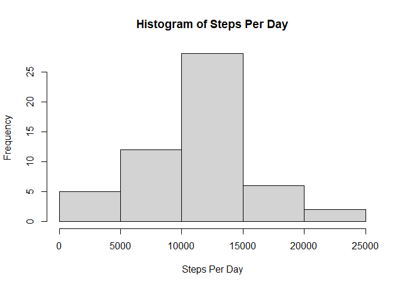
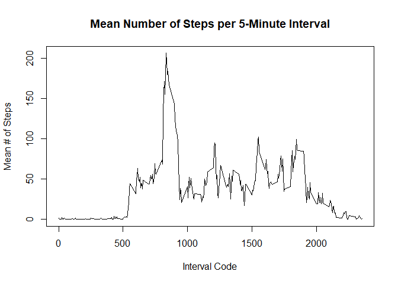
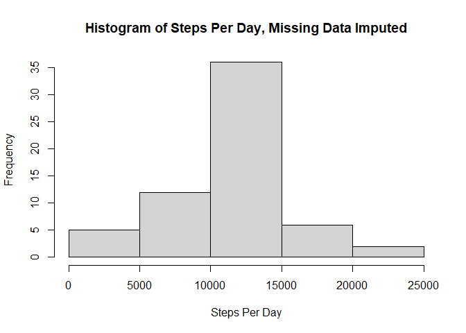
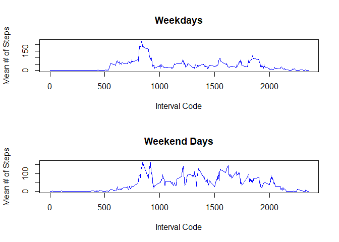

## Loading and preprocessing the data

First we need to unzip and read the data, which is in a .csv file.


```r
unz <- unzip("activity.zip")
data <- read.csv(unz)
str(data)
```

```
## 'data.frame':	17568 obs. of  3 variables:
##  $ steps   : int  NA NA NA NA NA NA NA NA NA NA ...
##  $ date    : chr  "2012-10-01" "2012-10-01" "2012-10-01" "2012-10-01" ...
##  $ interval: int  0 5 10 15 20 25 30 35 40 45 ...
```

From running the `str` function on our data, we can see that we have 17568 observations of 3 variables: steps, date, and interval. "Step" and "interval" are integers - that should be fine! But "date" is a character vector, which is not ideal. Let's make it into a proper date using the `as.Date` function.


```r
data$date <- as.Date(data$date, "%Y-%m-%d")
```

## What is mean total number of steps taken per day?

First, let's see the total number of steps taken each day. Since multiple rows in the dataset correspond to each date, we'll need to add up all the steps that occcured on the same date. We can use the `aggregate` function for this.


```r
byday <- aggregate(data$steps, 
                   by=list(Date=data$date), 
                   FUN=sum)
head(byday)
```

```
##         Date     x
## 1 2012-10-01    NA
## 2 2012-10-02   126
## 3 2012-10-03 11352
## 4 2012-10-04 12116
## 5 2012-10-05 13294
## 6 2012-10-06 15420
```

Let's then look at a histogram of TOTAL steps each day:


```r
hist(byday$x, 
     xlab="Steps Per Day", 
     main="Histogram of Steps Per Day")
```

<!-- -->

Now we can calcuate the MEAN and MEDIAN steps per day. For now we're ignoring missing values, using `na.rm=TRUE`. 


```r
mean(byday$x, na.rm=TRUE)
```

```
## [1] 10766.19
```

```r
median(byday$x, na.rm=TRUE)
```

```
## [1] 10765
```


## What is the average daily activity pattern?

Next, we're looking at steps by 5-minute interval rather than by day (each day is broken up into 5 minute chunks). Similar to our method for aggregating the steps data by date, here we'll aggregate it by inteval code. 

This, time, we'll skip the TOTAL step and go right to the MEAN for each interval. Again, we need to ignore missing values to calculate the mean.


```r
byint <- aggregate(data$steps,
                   by=list(interval=data$interval),
                   FUN=mean, 
                   na.rm=TRUE)
tail(byint)
```

```
##     interval         x
## 283     2330 2.6037736
## 284     2335 4.6981132
## 285     2340 3.3018868
## 286     2345 0.6415094
## 287     2350 0.2264151
## 288     2355 1.0754717
```

Looking at the last row of the new table we created, we can see that there are 288 interval codes. There are 1440 minutes in each day (24 hours x 60 minutes). Divide that by 5, for our 5 minute increments, and - ta da! - we get 288.

Okay, let's plot it as a time series.


```r
plot(byint$interval, 
     byint$x, 
     type="l", 
     xlab="Interval Code", 
     ylab="Mean # of Steps", 
     main="Mean Number of Steps per 5-Minute Interval")
```

<!-- -->

We can see a big spike somewhere around interval number 800. Let's find out where exactly that spike is (ie, the interval code with the maximum average daily steps) using the `which.max` function.


```r
maxint <- byint[which.max(byint$x), ]
maxint
```

```
##     interval        x
## 104      835 206.1698
```

Here, we can see that the 5-minute interval with the maximum average steps is . 

## Imputing missing values

Our data has some missing values! Let's see how many rows are missing data for the "steps" variable:


```r
sum(is.na(data$steps))
```

```
## [1] 2304
```

Wow! Fortunately, this is our only column with missing values. 

Okay, now it's time to deal with these missing data and not just ignore them. There's a few ways we could impute the missing data, some simpler than others. 

One way we could do it would be to replace each `NA` with the mean or median number of steps taken that day. If we look at the first day in our dataset, however, we see that the whole day is missing data! I'll just show the last few 5-minute intervals of that day to illustrate


```r
tail(data[1:288,])
```

```
##     steps       date interval
## 283    NA 2012-10-01     2330
## 284    NA 2012-10-01     2335
## 285    NA 2012-10-01     2340
## 286    NA 2012-10-01     2345
## 287    NA 2012-10-01     2350
## 288    NA 2012-10-01     2355
```

If we tried to find the mean number of steps for that day, we'd be taking the mean of all NAs - not much help!

So let's go with another familiar measure: the mean number of steps corresponding with each interval code. Since this is sampling across all the days, it's okay if a few days are missing data - we can still get a mean.

To impute the missing data, we'll use some functions from the `dplyr` package, so we'll load that first. Then, we'll use `left_join` to merge the original data with the "byint" data, which shows the average steps by interval code, into a new data frame called "imputed." Lastly, we'll use the `mutate` and `coalesce` functions to replace NAs with the mean number of steps for the corresponding interval code.


```r
library(dplyr)
```

```
## 
## Attaching package: 'dplyr'
```

```
## The following objects are masked from 'package:stats':
## 
##     filter, lag
```

```
## The following objects are masked from 'package:base':
## 
##     intersect, setdiff, setequal, union
```

```r
imputed <- data.frame(data)
imputed <- imputed %>% 
        left_join(byint, 
                  by="interval") %>% 
        mutate(steps = coalesce(steps, x))
head(imputed)
```

```
##       steps       date interval         x
## 1 1.7169811 2012-10-01        0 1.7169811
## 2 0.3396226 2012-10-01        5 0.3396226
## 3 0.1320755 2012-10-01       10 0.1320755
## 4 0.1509434 2012-10-01       15 0.1509434
## 5 0.0754717 2012-10-01       20 0.0754717
## 6 2.0943396 2012-10-01       25 2.0943396
```

No more missing data - yay! Now, let's do some computations similar to those that we did with the data when it included missing values. First, we'll calculate and make a histogram of the TOTAL number of steps taken each day.


```r
bydayimp <- aggregate(imputed$steps, 
                   by=list(Date=imputed$date), 
                   FUN=sum)
hist(bydayimp$x, 
     xlab="Steps Per Day", 
     main="Histogram of Steps Per Day, Missing Data Imputed")
```

<!-- -->

... and again, we'll calculate the MEAN and MEDIAN number of steps per day. No need for `na.rm=TRUE` here since we have no NAs!


```r
mean(bydayimp$x)
```

```
## [1] 10766.19
```

```r
median(bydayimp$x)
```

```
## [1] 10766.19
```

Let's look at the effect of imputing data on the mean and median of steps per day. A simple subtraction will do the trick.


```r
mean(bydayimp$x) - mean(byday$x, na.rm=TRUE)
```

```
## [1] 0
```

```r
median(bydayimp$x) - median(byday$x, na.rm=TRUE)
```

```
## [1] 1.188679
```

Here, we can see that imputing had **no effect** on the mean and a **small effect** on the median.

## Are there differences in activity patterns between weekdays and weekends?

Lastly, we'll look at how activity differs depending on whether a day is a weekday or a weekend day. Luckily, we already converted the "date" variable to class "date," so we can use the `weekdays` function to identify the day of the week for each date.

We'll first add a column to our data with imputed values added that gives the day of the week. We'll call this new variable, "dayofweek."

Then, we'll create a factor variable that has two levels: weekday and weekend. For the levels of the factor we'll use the unique values of "dayofweek," which happen to start with Monday. Accordingly, we can label these factors as 5 weekdays and 2 weekend days, in that order.


```r
imputed$dayofweek <- weekdays(imputed$date)
imputed$weekday <- factor(imputed$dayofweek,
                        levels=unique(
                                imputed$dayofweek), 
                        labels=c("weekday", "weekday","weekday","weekday","weekday","weekend","weekend"))
head(imputed)
```

```
##       steps       date interval         x dayofweek weekday
## 1 1.7169811 2012-10-01        0 1.7169811    Monday weekday
## 2 0.3396226 2012-10-01        5 0.3396226    Monday weekday
## 3 0.1320755 2012-10-01       10 0.1320755    Monday weekday
## 4 0.1509434 2012-10-01       15 0.1509434    Monday weekday
## 5 0.0754717 2012-10-01       20 0.0754717    Monday weekday
## 6 2.0943396 2012-10-01       25 2.0943396    Monday weekday
```

Great! We now know which data points fall on a weekday, and which fall on a weekend. (You'll notice that the "imputed" data frame has a variable in it called "x". This is the average number of steps per interval code that we used in a previous step.)

Let's plot it now. We'll create plots similar to the time plot we created earlier, but now we'll have 2: one for weekdays, one for weekend days. To do that, we'll first need to separate the data into two new corresponding data frames that, like the earlier plot, show us the average (mean) steps per 5 minute interval.

Last time we used `aggregate` from base R, but since we have the dplyr package now, let's use that instead. We'll call our two new dataframes "byintweekday" and "byintweekend."


```r
byintweekday <- imputed %>% 
                filter(weekday == "weekday") %>%
                group_by(interval) %>%
                summarize(mean(steps))
```

```
## `summarise()` ungrouping output (override with `.groups` argument)
```

```r
byintweekend <- imputed %>% 
                filter(weekday == "weekend") %>%
                group_by(interval) %>%
                summarize(mean(steps))
```

```
## `summarise()` ungrouping output (override with `.groups` argument)
```

We can take a glance at the first few rows of these to make sure it worked...


```r
head(byintweekday)
```

```
## # A tibble: 6 x 2
##   interval `mean(steps)`
##      <int>         <dbl>
## 1        0        2.25  
## 2        5        0.445 
## 3       10        0.173 
## 4       15        0.198 
## 5       20        0.0990
## 6       25        1.59
```

```r
head(byintweekend)
```

```
## # A tibble: 6 x 2
##   interval `mean(steps)`
##      <int>         <dbl>
## 1        0       0.215  
## 2        5       0.0425 
## 3       10       0.0165 
## 4       15       0.0189 
## 5       20       0.00943
## 6       25       3.51
```

Super! We've now got two 288 by 2 data frames to plot with. 

```r
par(mfrow=c(2,1))
plot(byintweekday[[1]], 
     byintweekday[[2]], 
     type="l", 
     col="blue",
     xlab="Interval Code", 
     ylab="Mean # of Steps", 
     main="Weekdays")
plot(byintweekend[[1]], 
     byintweekend[[2]], 
     type="l", 
     col="blue",
     xlab="Interval Code", 
     ylab="Mean # of Steps", 
     main="Weekend Days")
```

<!-- -->

